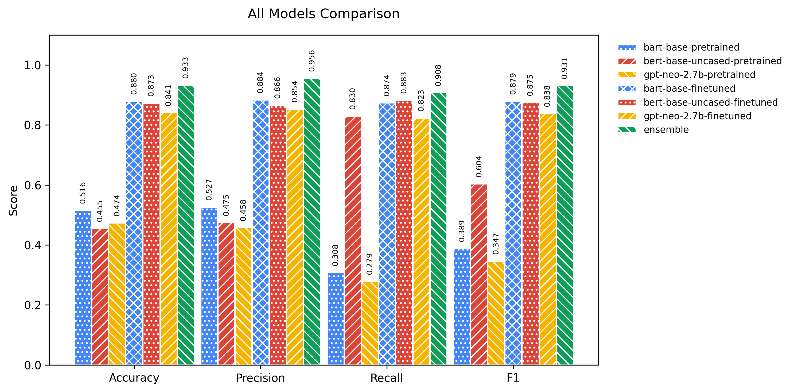

# 🧠 SENTIMENT ANALYSIS 2024/25 - UNICA

<p align="center">
  <a href="https://www.apache.org/licenses/LICENSE-2.0" target="_blank">
    
  </a>
  <a href="https://creativecommons.org/licenses/by/4.0/" target="_blank">
    
  </a>
</p>

<p align="center">
  
</p>

<p align="center">
  Project on <b>Binary Sentiment Analysis</b> using <b>Pretrained</b>, <b>Fine-tuned</b> and <b>Ensemble</b> Transformer Models.
</p>

---

> ## 📑 Summary
> 01. [🧑🏻‍🎓 Student](#student)  
> 02. [📌 Description](#description)  
> 03. [📄 Notebooks Overview](#notebooks-overview)  
> 04. [📁 Project Structure](#project-structure)  
> 05. [🔐 Access to Hugging Face Models](#access-to-hugging-face-models)  
> 06. [🚀 Installation](#installation)  
> 07. [🧪 Run: Model Training & Evaluation](#run-model-training--evaluation)  
> 08. [📊 Metrics and Outputs](#metrics-and-outputs)  
> 09. [🖥️ Hardware and Limitations](#hardware-and-limitations)  
> 10. [🤝 Contributions](#contributions)  
> 11. [📝 Licenses](#licenses)  
> 12. [❓ How to Cite](#how-to-cite)

---

## 1. 🧑🏻‍🎓 Student <a name="student"></a>

#### Francesco Congiu  
> Student ID: 60/73/65300  
>  
>> E-Mail: f.congiu38@studenti.unica.it  

---

## 2. 📌 Description <a name="description"></a>
This project investigates the impact of fine-tuning transformer-based models on the **Sentiment Analysis** task using the **IMDb dataset**.  
Three architectures are explored:

1. **Decoder-Only**: GPT-Neo  
2. **Encoder-Only**: BERT  
3. **Encoder-Decoder**: BART  

Additionally, we evaluate the performance of an **ensemble strategy** via **majority voting**.  
Both pretrained and fine-tuned versions are evaluated to compare generalization capabilities.

---

## 3. 📄 Notebooks Overview  <a name="notebooks-overview"></a>
> [!NOTE]
> Each notebook is self-contained and was provided for reproducibility.
> 
> Below a quick overview of each file:

| Notebook                             | Purpose                                                                       |
|--------------------------------------|-------------------------------------------------------------------------------|
| `train_models_from_scratch.ipynb`    | Fine-tune each model and evaluate them individually                           |
| `ensemble_model_evaluation.ipynb`    | Run ensemble predictions with majority voting                                 |
| `plot_results.ipynb`     | Plots the metrics results from `.json` files              |
| `test_models.ipynb`                  | Download fine-tuned models from HF, run individual inference, summary table and ensemble majority-vote |

---

## 4. 📁 Project Structure <a name="project-structure"></a>

```plaintext
📦 sentiment-analysis-transformers/
├── 📁 data/                          # (optional: IMDb dataset if local)
├── 📁 experiments/
│   ├── 📁 plots/                     # Graphs and result plots
│   └── 📁 results/
│       ├── 📁 evaluation/
│       │   ├── 📁 finetuned/
│       │   │   ├── bart-base-imdb.json
│       │   │   ├── bert-base-uncased-imdb.json
│       │   │   └── gpt-neo-2.7b-imdb.json
│       │   └── 📁 pretrained/
│       │       ├── bart-base-imdb.json
│       │       ├── bert-base-uncased-imdb.json
│       │       └── gpt-neo-2.7b-imdb.json
│       └── 📁 validation/
│           └── 📁 finetuned/
│               ├── bart-base-imdb_metrics.json
│               ├── bert-base-uncased-imdb_metrics.json
│               └── gpt-neo-2.7b-imdb_metrics.json
│
├── 📁 models/                        # Folder for storing our models
├── 📁 notebooks/
│   ├── train_models_from_scratch.ipynb
│   ├── ensemble_model_evaluation.ipynb
│   ├── plot_results.ipynb
│   └── test_models.ipynb
│
├── 📁 src/
│   ├── 📁 architectures/
│   │   ├── model_bart_base_imdb.py
│   │   ├── model_bert_base_uncased_imdb.py
│   │   ├── model_gpt_neo_2_7b_imdb.py
│   │   └── model_ensemble_majority_voting.py
│   ├── aggregate_json.py
│   ├── data_preprocessing.py
│   ├── download_models.py
│   ├── ensemble_analysis.py
│   ├── evaluate.py
│   ├── evaluate_ensemble.py
│   ├── model_configs.py
│   ├── model_configs_eval.py
│   ├── model_factory.py
│   ├── plot_results.py
│   ├── train.py
│   ├── upload_models.py
│   └── utils.py
│
├── main.py
├── requirements.txt
└── README.md
```

---

## 5. 🔐 Access to Hugging Face Models <a name="access-to-hugging-face-models"></a>

In order to download and use pretrained models from the 🤗 Hugging Face Hub (like `bert-base-uncased`, `gpt-neo-2.7B`, or `bart-base`), you’ll need to authenticate.

### 5.1 🪪 How to get your Hugging Face Token

1. Visit [https://huggingface.co/settings/tokens](https://huggingface.co/settings/tokens)
2. Click **New Token**, choose role `Read` and generate it
3. Copy the token to your clipboard

When running the notebook, you’ll be prompted to enter your token via:
```python
from huggingface_hub import notebook_login
notebook_login()
```
> [!NOTE]
> Run this manually in the first cell of the notebook if not already included. You only need to do this once per environment or session.

---

## 6. 🚀 Installation <a name="installation"></a>
Install requirements for any notebook as needed. For local runs, Python ≥ 3.8 is required.
> [!NOTE]
> For each notebook, you can use a dedicated environment to keep dependencies isolated.

---

## 7. 🧪 Run: Model Training & Evaluation <a name="run-model-training--evaluation"></a>

### 7.1 📘 `train_models_from_scratch.ipynb`
The notebook performs the entire process of analyzing the performance of pre-trained and fine-tuned models on the **Sentiment Analysis** task with the IMDb dataset. The following are the main steps write in the first notebook:

#### 7.1.1 ⚙️ Environment Setup

```bash
!nvidia-smi          # GPU verification
%ls                  # Checking the files present
```

#### 7.1.2 🔄 Cloning the repository
```bash
!test -d DLA_LLMSANALYSIS && rm -rf DLA_LLMSANALYSIS
!git clone https://github.com/wakaflocka17/DLA_LLMSANALYSIS.git
%cd DLA_LLMSANALYSIS
```

#### 7.1.3 🐍 Creation and activation of the virtual environment
```bash
!pip install virtualenv
!python -m virtualenv venv
!source venv/bin/activate
```

#### 7.1.4 📦 Installing dependencies
```bash
!venv/bin/pip install -r requirements.txt
```

#### 7.1.5 🔐 HuggingFace Login
```python
from huggingface_hub import notebook_login
notebook_login()
```

#### 7.1.6 🧠 Models training and evaluation
##### 🔹 **BERT**
```python
# Training
!venv/bin/python main.py --model_config_key bert_base_uncased --mode train

# Evaluation - pretrained
!venv/bin/python main.py --model_config_key bert_base_uncased --mode eval --eval_type pretrained --output_json_path "results/evaluation/pretrained/bert-base-uncased-imdb.json"

# Evaluation - fine-tuned
!venv/bin/python main.py --model_config_key bert_base_uncased --mode eval --eval_type fine_tuned --output_json_path "results/evaluation/finetuned/bert-base-uncased-imdb.json"
```

##### 🔹 **BART**
```python
# Training
!venv/bin/python main.py --model_config_key bart_base --mode train

# Evaluation - pretrained
!venv/bin/python main.py --model_config_key bart_base --mode eval --eval_type pretrained --output_json_path "results/evaluation/pretrained/bart-base-imdb.json"

# Evaluation - fine-tuned
!venv/bin/python main.py --model_config_key bart_base --mode eval --eval_type fine_tuned --output_json_path "results/evaluation/finetuned/bart-base-imdb.json"
```

##### 🔹 **GPT-Neo**
```python
# Training
!venv/bin/python main.py --model_config_key gpt_neo_2_7b --mode train

# Evaluation - pretrained
!venv/bin/python main.py --model_config_key gpt_neo_2_7b --mode eval --eval_type pretrained --output_json_path "results/evaluation/pretrained/gpt-neo-2.7b-imdb.json"

# Evaluation - fine-tuned
!venv/bin/python main.py --model_config_key gpt_neo_2_7b --mode eval --eval_type fine_tuned --output_json_path "results/evaluation/finetuned/gpt-neo-2.7b-imdb.json"
```

#### 7.1.7 ☁️ Uploading to Hugging Face Hub
```python
!venv/bin/python src/upload_models.py --only bert-base-uncased-imdb
!venv/bin/python src/upload_models.py --only bart-base-imdb
!venv/bin/python src/upload_models.py --only gpt-neo-2.7B-imdb
```

---

### 7.2 👥 `ensemble_model_evaluation.ipynb`
This notebook performs ensemble **Majority Voting** among the fine-tuned models for the **Sentiment Analysis** task on the IMDb dataset. Following are the steps performed:

#### 7.2.1 ⚙️ Environment Setup

```bash
!nvidia-smi          # GPU verification
%ls                  # Checking the files present
```

#### 7.2.2 🔄 Cloning the repository
```bash
!test -d DLA_LLMSANALYSIS && rm -rf DLA_LLMSANALYSIS
!git clone https://github.com/wakaflocka17/DLA_LLMSANALYSIS.git
%cd DLA_LLMSANALYSIS
```

#### 7.2.3 🐍 Creation and activation of the virtual environment
```bash
!pip install virtualenv
!python -m virtualenv venv
!source venv/bin/activate
```

#### 7.2.4 📦 Installing dependencies
```bash
!venv/bin/pip install -r requirements.in --constraint constraints.txt
```

#### 7.2.5 🔐 HuggingFace Login
```python
from huggingface_hub import notebook_login
notebook_login()
```

#### 7.2.6 ⬇️ Downloading Fine-Tuned models
##### 🔹 **BERT**
```python
# Download
!venv/bin/python src/download_models.py bert_base_uncased
```

##### 🔹 **BART**
```python
# Download
!venv/bin/python src/download_models.py bart_base
```

##### 🔹 **GPT-Neo**
```python
# Download
!venv/bin/python src/download_models.py gpt_neo_2_7b
```

#### 7.2.7 🧠 Ensemble model evaluation
```python
!venv/bin/python main.py --model_config_key ensemble_majority_voting --mode eval --eval_type fine_tuned --output_json_path "experiments/results/evaluation/ensemble-majority-voting-imdb.json"
```

#### 7.2.8 ☁️ Uploading the Ensemble model to Hugging Face Hub
```python
!venv/bin/python src/upload_models.py --only ensemble_majority_voting
```

---

### 7.3 📊 `plot_results.ipynb`
This notebook is used to plot the results of the evaluation of the models. It uses the `plot_results.py` script to generate the plots.

#### 7.3.1 🔄 Cloning the repository
```bash
!test -d DLA_LLMSANALYSIS && rm -rf DLA_LLMSANALYSIS
!git clone https://github.com/wakaflocka17/DLA_LLMSANALYSIS.git
%cd DLA_LLMSANALYSIS
```

#### 7.3.2 📊 Plotting the results
```python
import os, glob, json
import matplotlib.pyplot as plt
import matplotlib.transforms as mtransforms

# 1) Configuration
metrics     = ["accuracy", "precision", "recall", "f1"]
base_dir    = "experiments/results/evaluation"
single_keys = ["bart-base", "bert-base-uncased", "gpt-neo-2.7b"]

colors = {
    "bart-base":         "#4285F4",
    "bert-base-uncased": "#DB4437",
    "gpt-neo-2.7b":      "#F4B400",
    "ensemble":          "#0F9D58",
}
hatches = ['...', '///', '\\\\\\', 'xxx']


def load_evaluation(base_dir, metrics):
    """Carica tutti i JSON e restituisce un dict con pretrained, finetuned ed ensemble."""
    data = {"pretrained": {}, "finetuned": {}}
    for phase in data:
        for path in glob.glob(f"{base_dir}/{phase}/*-imdb.json"):
            name = os.path.basename(path).replace("-imdb.json", "")
            d = json.load(open(path))
            data[phase][name] = [d[m] for m in metrics]

    # ensemble
    ens_path = os.path.join(base_dir, "ensemble-mv-idb-metrics.json")
    if not os.path.exists(ens_path):
        raise FileNotFoundError("ensemble-mv-idb-metrics.json non trovato")
    em = json.load(open(ens_path))
    data["finetuned"]["ensemble"] = [em[m] for m in metrics]
    return data


def style_axes(ax):
    """Applica spine nere e setta un po’ di tight_layout / legend standard."""
    for s in ax.spines.values():
        s.set_visible(True)
        s.set_linewidth(0.8)
        s.set_color("black")
    ax.legend(loc="upper left", bbox_to_anchor=(1.02,1.0),
              frameon=False, fontsize="small")


def annotate_bars(ax, bars, rotate=False, pad=6, fontsize=7):
    """
    Posiziona le etichette sopra ogni barra.
    Se rotate=True le ruota di 90° e usa ax.text per centrarle.
    """
    if not rotate:
        for rects in bars:
            ax.bar_label(rects, fmt="%.3f", padding=pad, fontsize=fontsize)
    else:
        fig = ax.get_figure()
        for rects in bars:
            for r in rects:
                x = r.get_x() + r.get_width()/2
                y = r.get_height()
                trans = mtransforms.offset_copy(ax.transData, fig=fig,
                                                x=0, y=pad, units='points')
                ax.text(x, y, f"{y:.3f}",
                        transform=trans, ha='center', va='bottom',
                        rotation=90, fontsize=fontsize)


def plot_group(eval_values, labels, title, out_png,
               width_scale=0.8, rotate_labels=False,
               label_fontsize=7, label_padding=6, ylim_top=1.05):
    n = len(labels)
    x = range(len(metrics))
    width = width_scale / n

    fig, ax = plt.subplots(figsize=(8 + 2*rotate_labels, 4))
    bars = []
    for i, name in enumerate(labels):
        # --- qui determiniamo la chiave "base" per colors[name]
        if name == "ensemble":
            base = "ensemble"
        elif name.endswith("-pretrained"):
            base = name[:-11]
        elif name.endswith("-finetuned"):
            base = name[:-10]
        else:
            base = name

        rects = ax.bar(
            [xi + i*width for xi in x],
            eval_values[name],
            width=width,
            color=colors[base],          # ora usa la chiave corretta
            edgecolor="white",
            hatch=hatches[i % len(hatches)],
            linewidth=1.2,
            label=name
        )
        bars.append(rects)

    # annotate e resto identico...
    annotate_bars(ax, bars, rotate=rotate_labels,
                  pad=label_padding, fontsize=label_fontsize)

    ax.set_xticks([xi + width*(n-1)/2 for xi in x])
    ax.set_xticklabels([m.capitalize() for m in metrics])
    ax.set_ylim(0, ylim_top)
    ax.set_ylabel("Score")
    ax.set_title(title, pad=15)
    style_axes(ax)

    fig.tight_layout()
    fig.savefig(out_png, dpi=300, bbox_inches="tight")
    plt.show()


if __name__ == "__main__":
    data = load_evaluation(base_dir, metrics)

    # a) pretrained
    plot_group(
        data["pretrained"],
        single_keys,
        "Pretrained Models Evaluation",
        "pretrained_evaluation.png",
        width_scale=0.8,
        rotate_labels=False,
        ylim_top=1.05
    )

    # b) fine-tuned + ensemble
    plot_group(
        data["finetuned"],
        single_keys + ["ensemble"],
        "Fine-tuned Models & Ensemble Evaluation",
        "finetuned_plus_ensemble.png",
        width_scale=0.99,
        rotate_labels=True,
        label_fontsize=7,
        label_padding=6,
        ylim_top=1.10
    )

    # c) all models
    all_keys = [f"{k}-pretrained" for k in single_keys] + \
               [f"{k}-finetuned"  for k in single_keys] + \
               ["ensemble"]
    all_data = {
        **{f"{k}-pretrained": data["pretrained"][k] for k in single_keys},
        **{f"{k}-finetuned":  data["finetuned"][k]  for k in single_keys},
        "ensemble": data["finetuned"]["ensemble"]
    }

    plot_group(
        all_data,
        all_keys,
        "All Models Comparison",
        "all_models_comparison.png",
        width_scale=0.95,
        rotate_labels=True,
        label_fontsize=7,
        label_padding=6,
        ylim_top=1.10
    )
```

---

### 7.4 🤖 `test_models.ipynb`

This notebook pulls down your fine-tuned `BERT`, `BART` and `GPT-Neo` models from Hugging Face, wraps each in a HuggingFace Transformers pipeline, runs individual inference, builds a summary table, and finally runs a simple `majority-vote ensemble`.

#### 7.4.1 📦 Installing dependencies
```bash
!pip install transformers datasets huggingface_hub
```

#### 7.4.2 🔐 Hugging Face Login
```python
from huggingface_hub import notebook_login
notebook_login()  # paste your token when prompted
```
#### 7.4.3 🚀 Download & Load Models
```python
import pandas as pd
from collections import Counter
from IPython.display import display
from huggingface_hub import snapshot_download
from transformers import AutoTokenizer, AutoModelForSequenceClassification, pipeline

single_model_repos = {
    "BERT":    "wakaflocka17/bert-imdb-finetuned",
    "BART":    "wakaflocka17/bart-imdb-finetuned",
    "GPT-Neo": "wakaflocka17/gptneo-imdb-finetuned",
}

pipelines = {}

for name, repo_id in single_model_repos.items():
    local_dir = snapshot_download(repo_id)
    tok = AutoTokenizer.from_pretrained(local_dir)
    mdl = AutoModelForSequenceClassification.from_pretrained(local_dir)
    pipelines[name] = pipeline("text-classification", model=mdl, tokenizer=tok, return_all_scores=False)

print("✅ Pipelines loaded.")
```

#### 7.4.4 🔍 Build and display the Summary Table
```python
reviews = [
    "I absolutely loved this movie!",
    "Quite boring and too long."
]

ground_truths = ["POSITIVE", "NEGATIVE"]
rows = []

for text, gt in zip(reviews, ground_truths):
    preds = {name: pipelines[name]([text], batch_size=1)[0]["label"] for name in pipelines}
    vote = Counter(preds.values()).most_common(1)[0][0]
    rows.append({
        "Review": text,
        "Ground Truth": gt,
        **preds,
        "Ensemble Vote": vote
    })

df = pd.DataFrame(rows)
display(df)
```
Or, if you are interested in specifically testing one of the previously downloaded and set up models, take a look at the code below.

#### 7.4.5 🟨 Single model testing: Bert
```python
def infer_bert(text):
    return pipelines['BERT'](text)

single_review = "I absolutely loved this movie!"
reviews_list = [
    "A compelling and moving story.",
    "I found it rather dull and predictable."
]

print("BERT single:", infer_bert(single_review))
print("BERT batch:", pipelines['BERT'](reviews_list, batch_size=8))
```

#### 7.4.6 🟩 Single model testing: Bart
```python
def infer_bart(text):
    return pipelines['BART'](text)

single_review = "I absolutely loved this movie!"
reviews_list = [
    "A compelling and moving story.",
    "I found it rather dull and predictable."
]

print("BART single:", infer_bart(single_review))
print("BART batch:", pipelines['BART'](batch_reviews, batch_size=8))
```

#### 7.4.7 🟦 Single model testing: Gpt-Neo-2.7b
```python
def infer_gptneo(text):
    return pipelines['GPT-Neo'](text)

single_review = "I absolutely loved this movie!"
reviews_list = [
    "A compelling and moving story.",
    "I found it rather dull and predictable."
]

print("GPT-Neo single:", infer_gptneo(single_review))
print("GPT-Neo batch:", pipelines['GPT-Neo'](batch_reviews, batch_size=8))
```

#### 7.4.8 🟥 Single model testing: Ensemble model (using Majority Voting)
```python
from collections import Counter

single_review = "I absolutely loved this movie!"
reviews_list = [
    "A compelling and moving story.",
    "I found it rather dull and predictable."
]

print("=== Ensemble Predictions (Majority Vote) ===")

# Single review
single_vote = Counter(
    pipelines[name]([reviews[0]], batch_size=1)[0]["label"]
    for name in pipelines
).most_common(1)[0][0]
print(f"Single: {single_vote}")

# Batch of reviews
batch_votes = []
for text in reviews:
    preds = [pipelines[name]([text], batch_size=1)[0]["label"] for name in pipelines]
    vote = Counter(preds).most_common(1)[0][0]
    batch_votes.append(vote)
print(f"Batch: {batch_votes}")
```
---

## 8. 📊 Metrics and Outputs <a name="metrics-and-outputs"></a>

### 8.1 📑 Description
Each model evaluation is based on the following metrics:

| Metric      | Description                                      | Formula (Simplified)                            |
|-------------|--------------------------------------------------|-------------------------------------------------|
| Accuracy    | Overall correctness of the model                 | (TP + TN) / (TP + TN + FP + FN)                 |
| Precision   | How many predicted positives are correct         | TP / (TP + FP)                                  |
| Recall      | Ability to detect all true positives             | TP / (TP + FN)                                  |
| F1-Score    | Harmonic mean of precision and recall            | 2 × (Precision × Recall) / (Precision + Recall) |

> Where:
> - **TP** = True Positives  
> - **TN** = True Negatives  
> - **FP** = False Positives  
> - **FN** = False Negatives  

### 8.2 📂 Output Format

The evaluation metrics are saved as `.json` files for each model in the following format:

```json
{
  "accuracy": 0.91,
  "precision": 0.90,
  "recall": 0.91,
  "f1": 0.90
}
```

### 8.3 📊 Metrics Plots
To evaluate the effectiveness of our models on the `stanford/imdb` dataset, we generated three bar charts comparing the main classification metrics (Accuracy, Precision, Recall and F1-Score).

#### 8.3.1 Pretrained Models Evaluation  


In this first plot we compare the **out-of-the-box** performance of the pretrained versions of BART, BERT and GPT-Neo.
- **Accuracy**: `BART-base` gets the best result (0.516), while `GPT-Neo-2.7b` settles at 0.474 and `BERT-base-uncased` at 0.455;
- **Precision**: `BART-base` is still in the lead (0.527), with `BERT` at 0.475 and `GPT-Neo` at 0.458; 
- **Recall**: `BERT` stands out clearly (0.830), a sign of a strong ability to recover all positive instances, while `BART` and `GPT-Neo` remain below 0.31;  
- **F1-Score**: The harmony between precision and recall rewards `BERT` (0.604), compared with 0.389 for `BART` and 0.347 for `GPT-Neo`.

> [!NOTE]
>  **Insight**: from pretrained the transformer architectures are not yet homogeneous: `BERT` favors recall at the expense of accuracy, `BART` is more balanced, `GPT-Neo` suffers in all metrics.

#### 8.3.2 Fine-tuned Models & Ensemble Evaluation  
After we performed fine-tuning on the IMDB training set:

| Modello               | Accuracy | Precision | Recall | F1    |
|-----------------------|---------:|----------:|-------:|------:|
| **BART-base**         | 0.880    | 0.884     | 0.874  | 0.879 |
| **BERT-base-uncased** | 0.873    | 0.866     | 0.883  | 0.875 |
| **GPT-Neo-2.7b**      | 0.841    | 0.854     | 0.823  | 0.838 |
| **Ensemble**          | 0.933    | 0.956     | 0.908  | 0.931 |
- All models improve by more than +0.35 points in accuracy;  
- The **ensemble** achieves the highest accuracy (0.956) and also leads on accuracy (0.933) and F1 (0.931);  
- `BERT-base-uncased` wins the highest recall among singles (0.883) and an F1 of 0.875; 
- `GPT-Neo`, although enhanced by fine-tuning, remains the furthest behind with F1=0.838.

> [!NOTE]
>  **Insight**: fine-tuning completely transforms performance, narrowing the gap between architectures; ensemble, combining the strengths of each, proves to be the most robust choice.

#### 8.3.3 All Models Comparison
In this chart we place side by side:
1. **Pretrained** (light hatching);
2. **Fine-tuned** (dark hatching);
3. **Ensemble using Fine-tuned models** (green).

In fact, we can see how:
- The jump from pretrained (~0.50) to fine-tuned (~0.88) is evident on all metrics;
- No single fine-tuned model reaches ensemble levels: +0.053 in F1 compared to the best of the individuals;
- The ensemble acts as a “manifold” of strengths, offering the greatest stability on precision, recall, and F1.

#### 8.3.4 Conclusions
*These results highlight how, for our Binary Sentiment Analysis task, fine-tuning was essential to be able to extract relevant information. More importantly, it was essential to observe how the ensembler further multiplies the overall effectiveness of the other individual three models.* 

---

## 9. 🖥️ Hardware and Limitations <a name="hardware-and-limitations"></a>
> [!NOTE]
> 🧪 All training and evaluation were conducted on **Google Colab Pro+** with the following setup:
> - **Runtime environment**: Google Colab Pro+  
> - **GPU**: NVIDIA A100 (40GB VRAM)  
> - **RAM**: High-RAM Instance (≈ 52 GB)  
> - **Backend**: PyTorch with CUDA
> - **Cost**: €22 spent on Colab Pro+ to fully leverage GPU performance

> [!WARNING]
> - Training **GPT-Neo** locally (especially on CPU or low-VRAM GPU) may be extremely slow or unstable
> - If using Apple Silicon (M1/M2/M3/M4), consider the **MPS backend** but expect slower inference on large models

---

## 10. 🤝 Contributions <a name="contributions"></a>
Feel free to contribute to the project! 💡  
We welcome improvements, especially in the following areas:
- Adding new Transformer models (e.g. T5, DeBERTa, DistilBERT)
- Improving ensemble strategies (voting, stacking, etc.)
- Suggesting or implementing new evaluation metrics (e.g. calibration, fairness, coverage@k)

### 10.1 📌 How to Contribute <a name="how-to-cite"></a>

1. Fork the repository
2. Create a new branch:
   ```bash
   git checkout -b feature-name
   ```
3. Commit your changes:
   ```bash
   git commit -m "Add new evaluation metric"
   ```
4. Push the branch:
   ```bash
   git push origin feature-name
   ```
5. Open a Pull Request on GitHub
> 📬 We’ll review your proposal and get back to you as soon as possible!

---

## 11. 📝 Licenses <a name="licenses"></a>
> [!NOTE]
> **Code**: This repository's source code is licensed under the [Apache License 2.0](./LICENSE). You can read more at [http://www.apache.org/licenses/LICENSE-2.0](http://www.apache.org/licenses/LICENSE-2.0)
>
> **Documentation**: All documentation, including this README, is licensed under the [Creative Commons Attribution 4.0 International (CC BY 4.0)](https://creativecommons.org/licenses/by/4.0/). See the full text in the [LICENSE_DOCS](./LICENSE_DOCS) file.


---

## 12. ❓ How to Cite
```bibtex
@misc{Sentiment-Project,
author       = {Francesco Congiu},
title        = {Sentiment Analysis with Pretrained, Fine-tuned and Ensemble Transformer Models},
howpublished = {\url{https://github.com/wakaflocka17/DLA_LLMSANALYSIS}},
year         = {2025}
}
```
